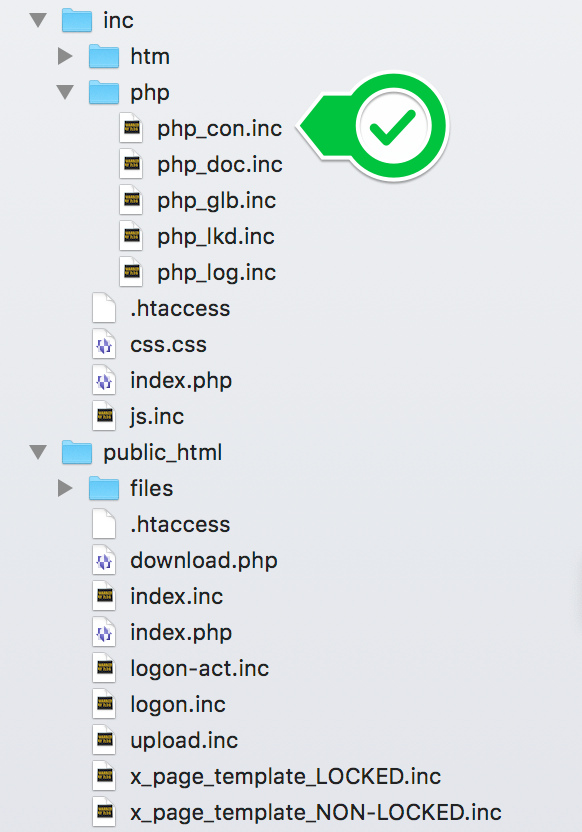

# Galoga Bootstrap Boilerplate
> #### Version 2.19.10 
> #### Date : 2019-10-26

## Welcome to the configure page
### Introductions
This configure instruction will take you through how yo configre the boilerplate to your tailored needs.

### First things first
When you have downloaded and opened the zip file, it will it contains the following:

### Where it all starts
Configure the variables in the config file called:

<code>/inc/php/php_con.inc</code>

### Deployment 

1. Move all content in the folder <code>/public_html</code> to the public folder of your webserver 
2. Move the folder <code>/inc</code> next to the public folder of your webserver 

### Pages and templates
All pages are called via the <code>index.php</code> in the public folder. All contents file are to be saved as <code>file_name.inc</code> to work properly.
To public URL will be www.your-site-name.com/pid=file-name

There are two type of page templates: 

1. Unlocked page template (access possible direct) : <code>x_page_template_NON-LOCKED.inc</code>
2. Locked page template (access only via logon): <code>x_page_template_LOCKED.inc</code>

