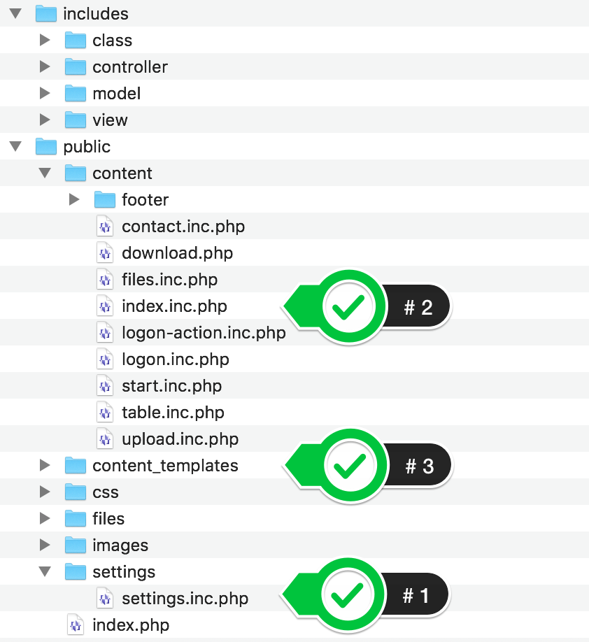

# Galoga Bootstrap Boilerplate
> #### Version 3.20.1 
> #### Date : 2020-01-04

## Welcome to the configure page
### Introductions
This configure instruction will take you through how yo configre the boilerplate to your tailored needs.

### First things first
When you have downloaded and opened the zip file, it will it contains the following:

### Where it all starts
Configure the variables in the config file called:

<code>/public/constants.inc.php</code>

### Deployment 

1. Move all content in the folder <code>/public</code> to the public folder of your webserver 
2. Move the folder <code>/includes</code> next to the public folder of your webserver 

### Pages and templates
All pages are called via the <code>index.php</code> in the public folder. All contents file are to be saved as <code>file-name.inc.php</code> to work properly.
To public URL will be www.your-site-name.com/pid=file-name.

There are one singel content template: 
